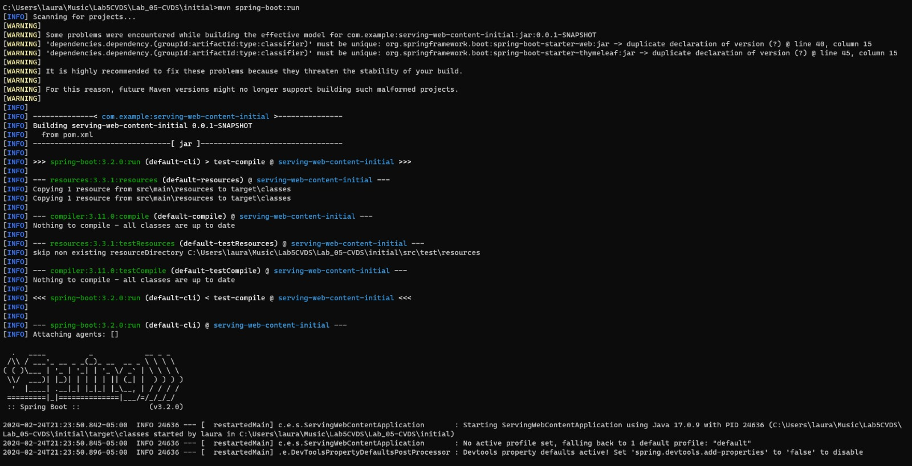
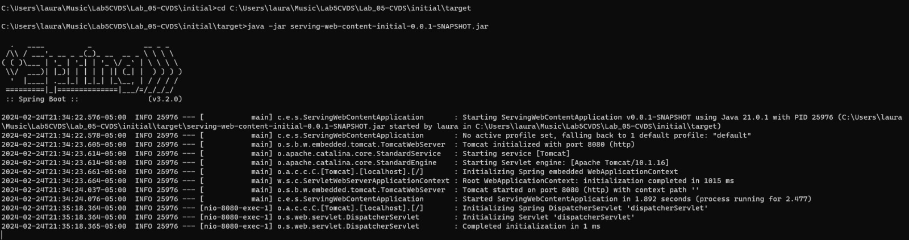
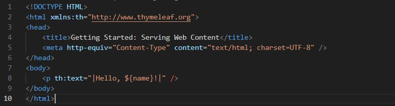
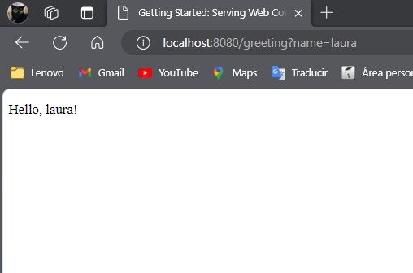

### Escuela Colombiana de Ingeniería

### Ciclo de Vida de Desarrollo de Software

## INTEGRANTES
# Laura Valentina Rodríguez - Juan Pablo Fernandez

## RESPUESTAS 

## PARTE I. - JUGANDO A SER UN CLIENTE HTTP
1. Abra una terminal Linux o consola de comandos Windows.
2. Realice una conexión síncrona TCP/IP a través de Telnet al siguiente servidor:
- Host: www.escuelaing.edu.co
- Puerto: 80
Teniendo en cuenta los parámetros del comando telnet:

```sh
$ telnet HOST PORT
```

3. Antes de que el servidor cierre la conexión por falta de comunicación:

Revise el RFC del protocolo HTTP, sobre cómo realizar una petición GET.
Debe lucir más o menos de esta forma:

```yml
GET /with-a-resource.html HTTP/1.0
Host: www.escuelaing.edu.co
```

Con esto, solicite al servidor el recurso `sssss/abc.html`, usando la versión 1.0 de HTTP.
Copie las dos lineas de codigo con el recurso agregado y peguelas en la consola del servidor ya abierta.
Asegúrese de presionar ENTER dos veces después de ingresar el comando.

Revise el resultado obtenido.

- ¿Qué codigo de error sale?, revise el significado del mismo en la lista de códigos de estado HTTP.
- ¿Qué otros códigos de error existen?, ¿En qué caso se manejarán?
- Responder en el README.md según lo indicado en la última sección de este laboratorio (ENTREGA).

4. Realice una nueva conexión con telnet, esta vez a:
```yml
Host: www.httpbin.org
Puerto: 80
Versión HTTP: 1.1
```

Ahora, solicite (GET) el recurso /html. ¿Qué se obtiene como resultado?

¡Muy bien!, ¡Acaba de usar del protocolo HTTP sin un navegador Web!. Cada vez que se usa un navegador, éste se conecta a un servidor HTTP, envía peticiones
del protocolo HTTP, espera el resultado de las mismas, y si se trata de contenido HTML lo interpreta y dibuja.

5. Seleccione el contenido HTML de la respuesta y copielo al cortapapeles `CTRL-SHIFT-C`. Ejecute el comando wc (word count) para contar palabras con la
opción -c para contar el número de caracteres:
```sh
$ wc -c
```

Pegue el contenido del portapapeles con `CTRL-SHIFT-V` y presione `CTRL-D` (fin de archivo de Linux). Si no termina el comando `wc` presione `CTRL-D`
de nuevo. No presione mas de dos veces CTRL-D indica que se termino la entrada y puede cerrarle la terminal. Debe salir el resultado de la cantidad de
caracteres que tiene el contenido HTML que respondió el servidor.

Claro está, las peticiones GET son insuficientes en muchos casos. Investigue: ¿Cuál esla diferencia entre los verbos GET y POST? ¿Qué otros tipos de
peticiones existen?
7. En la practica no se utiliza telnet para hacer peticiones a sitios web sino el comando curl con ayuda de la linea de comandos: 
```sh
$ curl "www.httpbin.org"
```
Utilice ahora el parámetro -v y con el parámetro -i:

```sh
$ curl -v www.httpbin.org
$ curl -i www.httpbin.org
```
¿Cuáles son las diferencias con los diferentes parámetros?


## PARTE II. - HACIENDO UNA APLICACIÓN WEB DINÁMICA USANDO EL PATRÓN MVC
En este ejercicio, va a implementar una aplicación Web muy básica, haciendo uso de spring MVC.

Para esto usaremos la documentación oficial de Spring con que que aprenderemos las funciones básicas de este framework https://spring.io/guides/gs/serving-web-content/

Para compilar la aplicación Web 

```
mvn spring-boot:run
```



Crear el archivo .jar 

```
java -jar serving-web-content-initial-0.0.1-SNAPSHOT.jar
```



Lo que está en nuestra aplicación Web es:



Y así se verá: 

```
http://localhost:8080/greeting?name=laura
```
o
```
http://localhost:8080/greeting
```


Después de terminar el aprendizaje analice: 
- ¿Por qué MVC obtiene ese nombre? (puede apoyarse de https://www.javatpoint.com/spring-mvc-tutorial) 

MVC (Modelo-Vista-Controlador) es un patrón de diseño arquitectónico que separa una aplicación en tres componentes principales: Modelo, Vista y Controlador. Obtiene su nombre de la abreviatura de estos tres componentes:

1. Modelo (Model): Representa los datos y la lógica de negocio de la aplicación. Es responsable de interactuar con la base de datos y manejar la lógica empresarial.

2. Vista (View): Es la interfaz de usuario con la que interactúa el usuario. Presenta los datos al usuario de una manera legible y comprensible.

3. Controlador (Controller): Actúa como intermediario entre el Modelo y la Vista. Responde a las solicitudes del usuario, manipula los datos entrantes, realiza la lógica de negocio y finalmente selecciona la Vista adecuada para mostrar al usuario.


- ¿Cuáles son las ventajas de usar MVC? 
1. Soporte para multiples interfaces de usuario
2. Facilidad de pruebas
3. Separación de responsabilidades
4. Reutilización de código

- ¿Qué diferencia tiene la estructura de directorios de este proyecto comparado con las de proyectos pasados (con solo maven y java EE)? 
Para la parte de construcción de directorios, es importante tener en cuenta que ahora se tiene un nuevo directorio en src/main/*resources*
    /resources
        /static 
        /templates


- ¿Qué anotaciones usaste y cuál es la diferencia entre ellas?
1. @Controller: Esta anotación se utiliza para marcar una clase como un controlador en el patrón MVC de Spring. Indica que la clase define métodos de controlador que manejan las solicitudes entrantes.

2. @GetMapping: Esta anotación se utiliza para asignar solicitudes HTTP GET a métodos de controlador específicos. Es una forma conveniente de configurar los métodos de controlador para manejar solicitudes GET sin la necesidad de configuración adicional.

3. @RequestParam: Esta anotación se utiliza para vincular parámetros de solicitud a parámetros de método en un controlador de Spring MVC. Permite acceder a los valores de los parámetros de solicitud (como los parámetros de consulta) dentro de los métodos de controlador.

## PARTE III. - APLICACIÓN MVC PARA CONSUMO DE SERVICIO RESTful
Usando la arquitectura MVC del punto anterior (el proyecto anterior), realice una aplicación simple qué permita navegar gráficamente sobre esta API https://jsonplaceholder.typicode.com/todos/1, puede guiarse de tutoriales como https://medium.com/@nutanbhogendrasharma/consume-rest-api-in-spring-boot-web-application-354c404850f0

Luego de terminada esta parte responda: - ¿Qué es RESTful? - Si utilizo un framework como Boostrap CSS para qué el apartado gráfico se vea más profesional, ¿en qué capa se haría su uso?